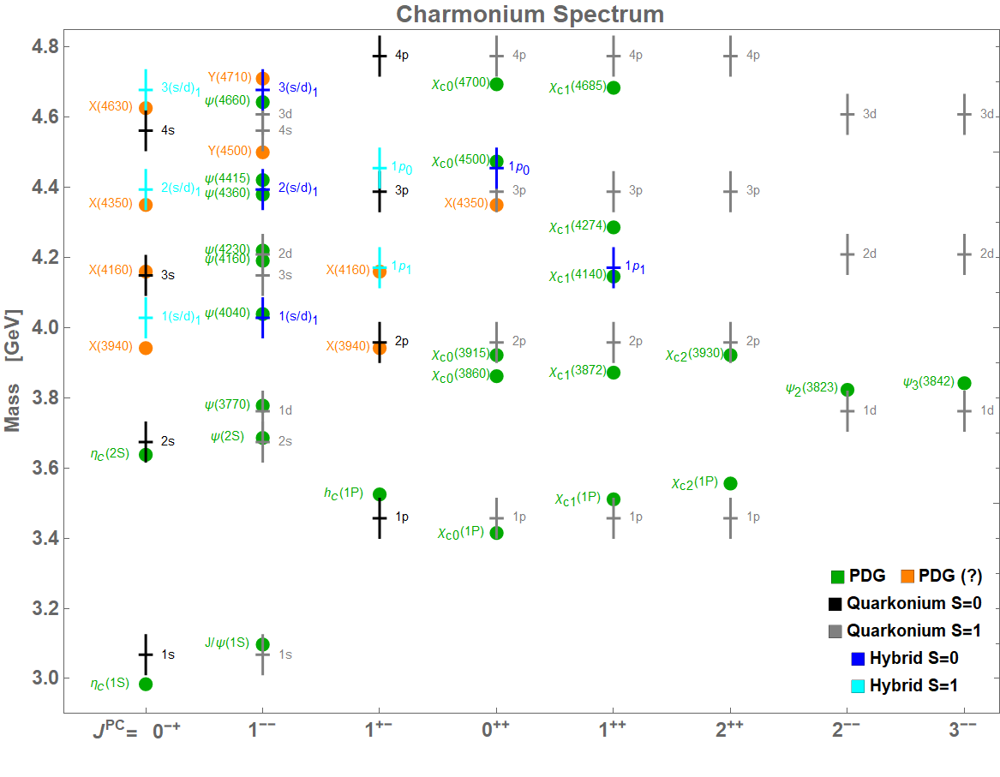
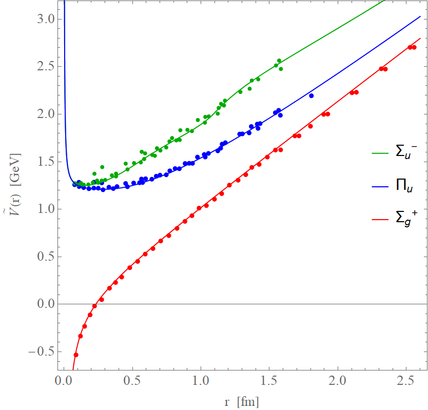

# hybrid_quarkonia

This repository contains MATLAB codes to solve the **spectrum** and **wavefunctions** of quarkonium and hybrid states through numerical solutions of the Schrödinger equation.

---

## 📂 Repository Structure

<b>Main scripts</b>

- **`potential.m`**  🟥
  Defines the **static potentials** used in the calculations.
  **⚠️ Note:** `potential.m` should be placed inside the `\sources` directory.

- **`*_equations.m`**  🟥
  Contains the Schrödinger equations that describe each state.  
  These functions are used by the next two files and depend on the files inside the `\sources` folder — particularly **`potential.m`**.  
  **⚠️ Note:** `*_equations.m` should be placed inside the `\sources` directory.

- **`*_spectrum.m`**  
  Generates the corresponding **`*_spectrum.dat`** files for both **quarkonium** and **hybrid** states.  
  The output includes the **energy levels** and the **expected radial values** ⟨r⟩.

- **`*_decay.m`**  
  Produces the **`*_decay.dat`** files for hybrid states.  
  The output contains the **overlap integrals** required for **hybrid → quarkonium** decay calculations.

<b>Sources folder</b>

- **`*_equations.m`**  
  Contains the Schrödinger equations that describe each state, including the definition of the **matrix potentials** required for each configuration.  
  These functions are called by the main files.

- **`potential.m`**  
  Defines the **static potentials** used in the calculations.

- **`*.m`**  
  Implements the **numerical methods** used to compute the **eigenvalues** and **eigenfunctions** of the Schrödinger equations,  
  including the treatment of **matrix (m×m) dimension potentials** and **non-diagonal coupling terms**.  
  These functions are called by `*_equations.m`.

<b>Output folder</b>

- **`*_spectrum.dat`** and **`*_decay.dat`** – List of numerical results (spectrum and decay data files for each state).  
- **`decay_tables/`** – Summarized tables with relevant transition channels: decay width computations and errors analysis. In **Excel** with color codes and printed in **PDF** format.  

---

## 📘 References

- Equations for hybrid states:  
  **Phys. Rev. D 96, 014004 (2017)**  
  [https://doi.org/10.1103/PhysRevD.96.014004](https://doi.org/10.1103/PhysRevD.96.014004)

- Hybrid to quarkonium decay framework:  
  **DOI:** _(to be added)_

---

## ⚛️ Hybrid State Labels

| Label | Wave Function Type | Example States | Description |
|:------|:-------------------|:---------------|:-------------|
| **H1** | $P^\pm_J$ (denoted as `hybridPpm`) | $n(s/d)_1$, $n(p/f)_2$, ... | Coupled hybrid ($J > 0$, $J = L \pm 1$) with $Π_u$ and $Σ_u^⁻$ potentials |
| **H2** | $P^0_J$ (denoted as `hybridP0`) | $np_1$, $nd_2$, ... | Decoupled hybrid ($J > 0$, $J = L$) with $Π_u$ potential |
| **H3** | $P^+_0$ (denoted as `hybridPplus0`) | $np_0$ | Decoupled hybrid ($J = 0$) with $Σ_u^⁻$ potential |

---

## 📊 Example Figures

| Charmonium Spectrum | Bottomonium Spectrum | Static Potentials |
|:--------------------:|:--------------------:|:------------------:|
|  |  |  |

---

## 🧮 Notes

- Each `.dat` file includes clear headers with column descriptions and units.  
- All computations are performed in **GeV**.  
- The results can be directly reused for plotting or for further decay analysis.
- The results can be compared to [Particle Data Group observations]( https://pdg.lbl.gov/2025/listings/contents_listings.html) for $c\bar{c}$ or $b\bar{b}$ mesons (also called XYZ mesons) at zero isospin $I^G=0^-,0^+$.

---

## 🧾 Citation

If you use these codes or results, please cite the corresponding reference:  
> **DOI:** _(to be added)_

