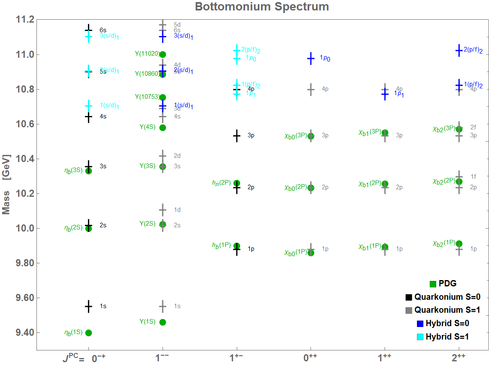

# hybrid_quarkonia

This repository contains MATLAB codes to solve the **spectrum** and **wavefunctions** of quarkonium and hybrid states through numerical solutions of the Schrödinger equation.

---

## 📂 Repository Structure

<b>Main scripts</b>

- **`_equations.m`**  
  Contains the Schrödinger equations that describe each state.  
  These functions are used by the next two files.

- **`_spectrum.m`**  
  Generates the corresponding `_spectrum.dat` files for quarkonium and hybrid states.  
  The output includes **energy levels** and **expected radial values** ⟨r⟩.

- **`_decay.m`**  
  Produces the `_decay.dat` files for hybrid states.  
  The output contains **overlap integrals** required for **hybrid → quarkonium** decay calculations.

<b>Output folders</b>

- **`output/`** – Numerical results (spectrum and decay data files).  
- **`decay_tables/`** – Summarized tables in **Excel** and **PDF** format.  
- **`fig/`** – Illustrative plots of potentials and spectra.

---

## 📘 References

- Equations for hybrid states:  
  **Phys. Rev. D 96, 014004 (2017)**  
  [https://doi.org/10.1103/PhysRevD.96.014004](https://doi.org/10.1103/PhysRevD.96.014004)

- Hybrid → quarkonium decay framework:  
  **DOI:** _(to be added)_

---

## ⚛️ Hybrid State Labels

| Label | Wave Function Type | Example States | Description |
|:------|:-------------------|:---------------|:-------------|
| **H1** | `P^\pm_J` | (s/d)\_1, (p/f)\_2, ... | Coupled hybrid (J > 0, J = L ± 1) with Π_u and Σ_u⁻ potentials |
| **H2** | `P0` | p\_1, d\_2, ... | Decoupled hybrid (J > 0, J = L) with Π_u potential |
| **H3** | `Pplus0` | p\_0 | Decoupled hybrid (J = 0) with Σ_u⁻ potential |

---

## 📊 Example Figures

| Charmonium Spectrum | Bottomonium Spectrum | Static Potentials |
|:--------------------:|:--------------------:|:------------------:|
|  |  |  |

---

## 🧮 Notes

- All computations are performed in **GeV** units.  
- The results can be directly reused for plotting or for further decay analysis.  
- Each `.dat` file includes clear headers with column descriptions and units.  

---

## 🧾 Citation

If you use these codes or results, please cite the corresponding reference:  
> **DOI:** _(to be added)_

