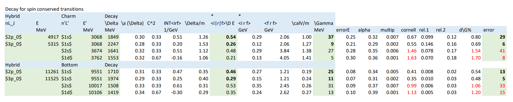
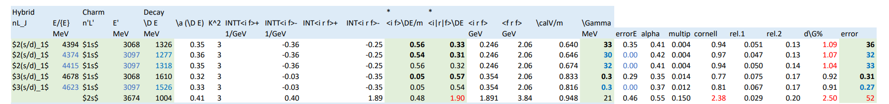

# Decay Tables

This directory contains the structured, color-coded, and results of the hybrid-to-quarkonium decay calculations, formatted both as **Excel tables** (for analysis) and **PDF printout** (for documentation).

- We use the following color code:
  1. **Green** — transitions that survive the constraints.  
  2. **Red** — transitions that do not survive certain constraints, or have an error component > 1.  
  3. **Bold Black** — transitions that survive the constraints and have an error component $\lesssim 1$.  **Black values** are those **included in the draft**.
  4. **Blue** — transitions that survive the constraints, have an error component $\lesssim 1$, and whose initial and final states can be identified with XYZ mesons observed by the PDG. **Blue values** are those **added to the identification table** in the draft.

---

## File Content

- The **first three pages** of the PDF correspond to the **transitions that survive the constraints**:
  1. **Spin-conserved**
  2. **Spin-flip** starting from **spin 0**
  3. **Spin-flip** starting from **spin 1**

- **From the 4th to the 12th pages**, the PDF contains the **full tables of transitions**. These include the cases allowed for ΔE > 0 and the constraints specified in the reference, but without calculation errors. Transitions that **satisfy all constraints** are shown in **green**, while those that do not are shown in **red**.

- The **last pages** of the PDF include the definitions of the VBA functions used. Occasionally, these functions may be **deleted or lost** from the VBA module. If that happens, they can simply be **copied and pasted** again into a **new VBA module** within the Excel file.

---

## Column Definitions

This section defines all quantities appearing in the decay tables and clarifies how spin-conserved and spin-flip transitions are treated in the computation of the hybrid → quarkonium decay widths.

### General Quantities

| Symbol / Column | Meaning | Units / Notes |
|-----------------|----------|---------------|
| **$ΔE$** | Energy difference between the hybrid initial $\langle i \|$ and the quarkonium final $\| f\rangle$ states. | MeV|
| **α** | $\alpha(\Delta E)$ - QCD strong coupling constant used in decay rate formulas | dimensionless |
| **C²** or **K²** | Coefficients encoding the angular momentum integral between hybrid and quarkonium states | dimensionless|
| **INT⟨i r f⟩** | Radial overlap integral between initial and final wave functions, without angular coefficients | GeV⁻¹ |
| **Γ** | Computed decay rate | MeV |
| **𝒱** | Defined as $(E_i-\langle i \| V \| i\rangle )+(E_f-\langle f \| V\| f \rangle)$ | GeV |
| **errorE** | Energy uncertainty: $3 \delta \Delta E/\Delta E$  | dimensionless |
| **alpha** | Variation of the running coupling uncertainty: $\delta \alpha / \alpha$ | dimensionless |
| **multip** | Multipole term uncertainty: $(⟨i \| r \| f⟩ ΔE)² / 120$ for spin-conserved transitions; $/ 24$ for spin-flip transitions | dimensionless |
| **cornell** | Confining vs Coulomb uncertainty: $3 (0.215 × ⟨f \| r \| f⟩ − 0.028) / ΔE$ | dimensionless |
| **rel.1** | First relativistic correction term: $ΔE / 16 m_Q$ | — |
| **rel.2** | Second relativistic correction term: $𝒱 / 8 m_Q$ for spin conserved or $5 𝒱 / 24 m_Q$ for spin-flip | dimensionless |
| **dΓ** | Total relative error: quadratic sum of individual uncertainties | % |
| **error** | Absolute decay rate uncertainty: dΓ × Γ | MeV |

---

### Notes
- Quantities marked with “*” are **computed directly from numerical wave-function overlaps** and does not include angular momentum coefficients **C²** or **K²** 
- Example: for **Spin-conserved:** $⟨H r S⟩ = \|⟨i r f⟩\| × √(C²)$   used for **Γ** calculation, while $⟨i r f⟩ = \|⟨i r f⟩\|$   used for used for **multip** term. 
